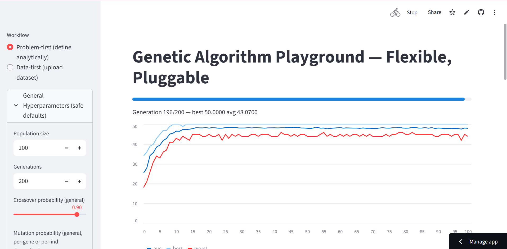

# Genetic Algorithm Playground (Streamlit)

Single-file Streamlit app: `streamlit_genetic_algorithm_app.py`

## Live App
[Open the app in your browser](https://genetic-algorithm-bzb2dpqduhbmdbjram2qjx.streamlit.app/)

## Quick start (local)
1. Create & activate a virtualenv (optional but recommended).
2. Install requirements:
   ```bash
   pip install -r requirements.txt

## App Interface

